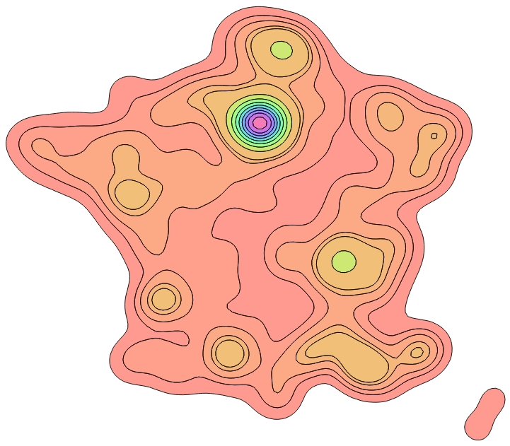

# Contour-isobands-rs

Compute isobands and contour polygons (using marching squares algorithm).

While [`contour-rs`](https://github.com/mthh/contour-rs) computes isolines (cf. https://en.wikipedia.org/wiki/Marching_squares#Disambiguation_of_saddle_points) and
their corresponding polygons (i.e. polygons that contain all points above the threshold defined for a given isoline),
`contour-isobands-rs` computes isobands (cf. https://en.wikipedia.org/wiki/Marching_squares#Isobands) and their
corresponding polygons (i.e. *true* contour polygons, polygons that contain all points between a minimum and a maximum bound).

### Status

This library is WIP, but it should be published on crates.io soon.

Current status / roadmap is as follows:

- [x] All the isobands code (from [RaumZeit/MarchingSquares.js](https://github.com/RaumZeit/MarchingSquares.js)) is ported and tests are passing
- [x] Return contours using geo_types primitives and propose GeoJSON serialisation
- [ ] API is polished enough (and close to contour-rs API)
- [ ] Rename [`contour-rs`](https://github.com/mthh/contour-rs)  to `contour-isolines-rs` to distinguish it from this library (`contour-isobands-rs`)
- [ ] Publish on crates.io
- [x] Implement a spatial index to filter calls to `prepare_cell` (although it only yields improved performance for large grids / when using numerous thresholds)
- [ ] Make a WASM example (WIP - see https://github.com/mthh/contour-isobands-wasm)

### Licence

Since this is a port from [https://github.com/RaumZeit/MarchingSquares.js](https://github.com/RaumZeit/MarchingSquares.js) which is licenced under the Affero General Public License v3.0, this project is also licenced under the Affero General Public License v3.0.
See the [LICENSE](LICENSE) file for details.